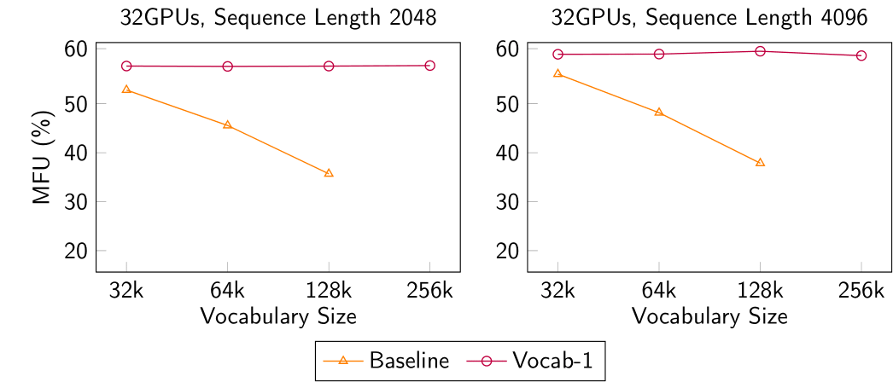
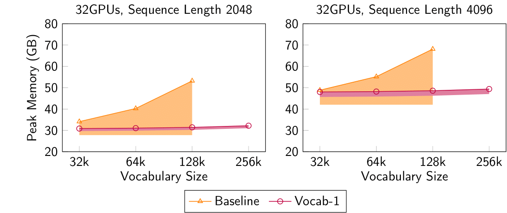

This repository is a fork of [Megatron-LM](https://github.com/NVIDIA/Megatron-LM/). The original README can be found [here](Megatron.md).

# Balancing Pipeline Parallelism with Vocabulary Parallelism

Vocabulary Parallelism is a novel technique that balances the computation and memory of vocabulary layers in pipeline parallelism.
This branch contains a Vocabulary Parallelism implementation supported on the *V-Half* schedule.

Check out the [main repository for Vocabulary Parallelism](https://github.com/sail-sg/VocabularyParallelism) for more information.

**Quick Start:**

Run
```shell
VOCAB_PARALLEL=1 VOCAB_SIZE=256k examples/pretrain_zero_bubble.sh
```

This script comes with a dataset with varying vocabulary sizes of 32k, 64k, 128k and 256k. Change the vocabulary size by setting `VOCAB_SIZE` to either `32k`, `64k`, `128k` or `256k`.

Alternatively, include the following arguments when training with the GPT legacy model. Vocabulary Parallelism is not yet supported for the other models.

```
  --use-legacy-models
  --transformer-impl local
  --enable-zb-runtime
  --zero-bubble-v-schedule
  --zero-bubble-v-schedule-mem-setup half
  --enable-vocab-parallel
```

By default, Vocabulary Parallelism with 1 all-reduce communication barrier is applied. To switch to 2 all-reduce communication barriers, supply the argument `--disable-backward-fusion` (or `FB_SPLIT=1`).

## Evaluation

On the *V-Half* schedule, Vocabulary Parallelism results in a 7.2% to 143% improvement in throughput compared to the baseline implementation, meanwhile significantly reducing peak memory usage. Notably, Vocabulary Parallelism achieves a perfect balance in both memory and computation.





*Note: The baseline implementation OOMs when the vocabulary size is 256k.*
